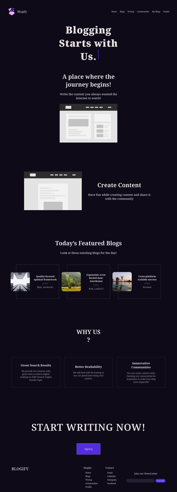
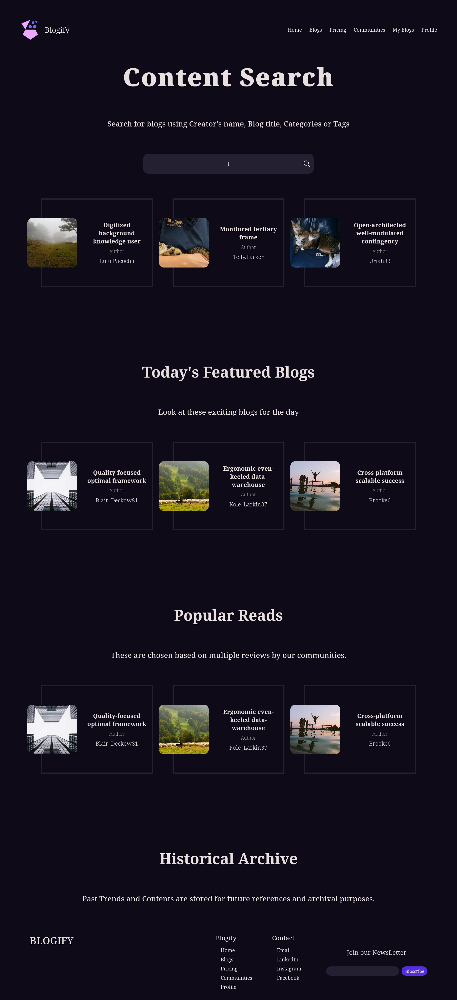
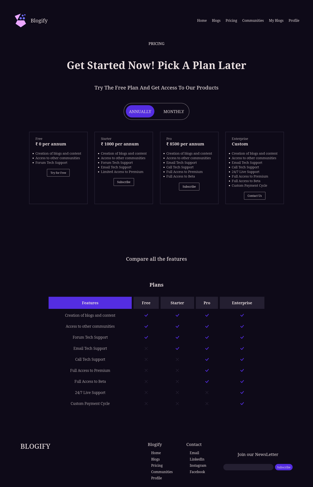
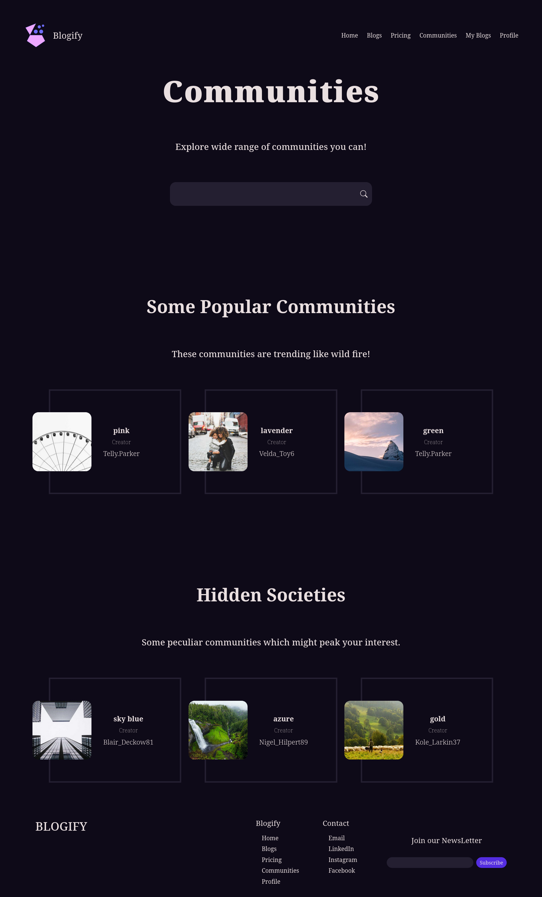
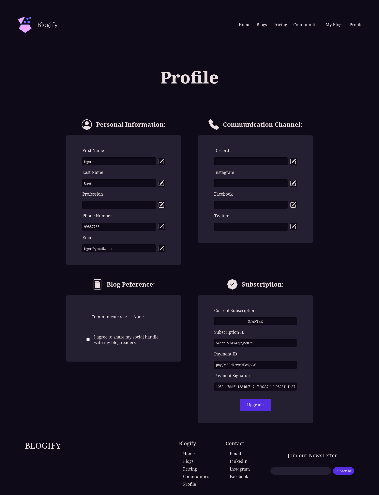

# Blogify

- This project helps users to create their own blogs for fun.
- The site is built with react, nextjs, typescript
- The api is built with node, express, mongodb with JWT Auth

#### Minimum Requirements

1. CPU: 2core
2. RAM: 4GB
3. Storage: HDD

> **Advice**
> The minimum requirements are given in an assumption it will be run on a Linux machine

## Quick Run Instructions

1. Clone or download the project.
2. In indiviual folders(website,api) install the node modules using

```bash
npm install .
```

3. Then go to the MongoDB Atlas, create an account then a cluster and get the API token
4. Create a `.env` file in api folder with an entry:

```js
MONGO_URI = "<your-mongodb-token>"
JWT_KEY = "<your-jwt-token>"
```

ADDITIONALLY if running locally use to prevent CORS errors and port conflict

```js
PORT = 3120
CORS_URL = "http://localhost:3000"
```

5. Now in website we will do the same by creating `.env` file with values

```js
// API URL [if running locally use "http://localhost:3120"]
NEXT_PUBLIC_API_URL="<your-backend-url>"
```

## Perform Analysis

To do a quick view of the size of the website while testing, run the following command:

```bash
npm run analyze
```

## Screenshots

### Home



### Blogs



### Pricing



### Communities



### Profile


